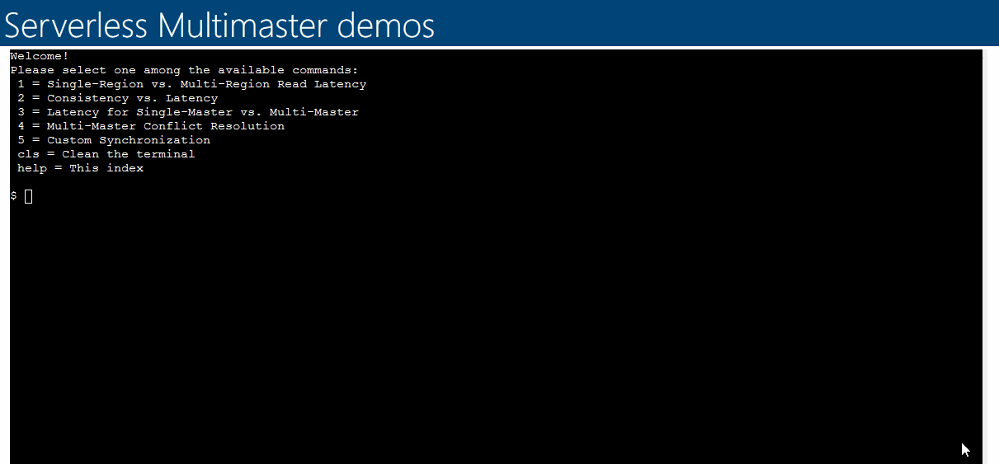

# Cosmos Global Distribution Demos

## Introduction

This solution contains a series of benchmarks that demonstrate various concepts for distributed databases, particularly around consistency, latency and distance. The tests in this solution include:

### 1. Read latency between single region and multi-region replicated accounts

This test shows the difference in read latency for an account with a single master in SouthEast Asia region with a front end reading from it in West US 2. The next test shows the drastic improvement in latency with data locality when the account is replicated to West US 2.

### 2. Write latency for accounts with Eventual consistency vs. Strong consistency + impact of distance on Strong consistency

This test shows the difference in write latency for two accounts with replicas 1000 miles apart in West US 2 and Central US regions, one with Eventual consistency, the other with Strong consistency. There is a third test that shows the impact on latency when the distance between the regions is more than double the distance, demonstrating the speed of light impact on latency when using Strong consistency across large distances.

### 3. Read and write latency for Single-Master account versus Multi-Master account

This test shows the difference in read latency for a single-master account (master: East US 2, replica: West US 2) with a client in West US 2. The next test shows the impact on write latency when using a multi-master account (master: East US 2, West US 2) with a client in West US 2.

### 4. Multi-Master Conflict Resolution

This test shows the Last Write Wins and Merge Procedure conflict resolution modes as well as "Async" mode where conflicts are written to the Conflicts Feed.

### 5. Custom Synchronization

This test shows how to implement a custom synchronization between two regions. This allows you to have a lower level of consistency for a database with many replicas across great distances. This scenario shows an account with four regions (West US, West US 2, East US, East US 2) at Session level consistency but with Strong consistency between West US and West US 2. This provides for greater data durability (RPO = 0) without having to use Strong consistency across all regions and over very large distances. This demo includes a separate class that shows a simpler implementation of this you can more easily use without all the timer code.

## Provisioning Cosmos DB accounts

This solution requires nine different Cosmos DB accounts. Each of are configured differently to support the underlying test with different replication modes, consistency levels and regions.
To simplify this process, an [ARM template](./azuredeploy.json) has been provided.

### Deploy it with one click

Just click in the Deploy to **Azure button** and it will guide you into automatically creating the Azure Function app with all the code deployed on Azure.

## Initializing the Demos

After the accounts are provisioned you can launch the application using your browser, by going to `https://<name-provided-during-creation>.azurewebsites.net`.

Run the `init` command to provision the required containers, after which you can simply run any of the demos following the visual console:

> After 2 hours of inactivity, the containers are removed to reduce operational costs. If needed for a new demo, just run the `init` command again.
